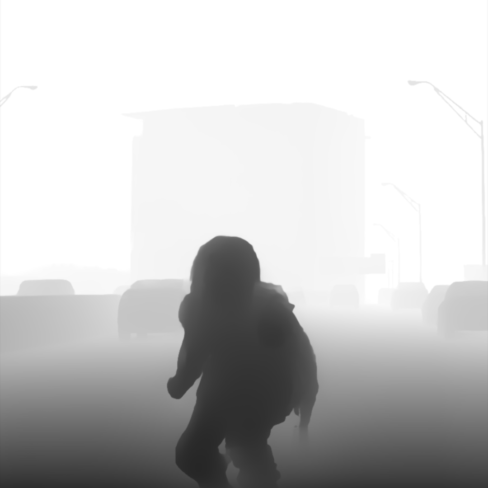
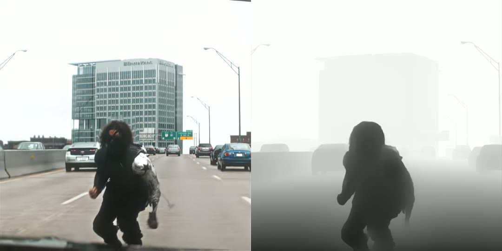

# LTW Depth Style

A DaVinci Resolve script that switches a clip from **normal picture** to a **viral depth-map look** on a hit — goal, punch, bass drop, shield catch.

Works in **DaVinci Resolve Free** and **DaVinci Resolve Studio**.

<p align="center">
  
</p>



<p align="center">
  <a href="docs/demo-hit.mp4">Hit (color → depth)</a>
  &nbsp;·&nbsp;
  <a href="docs/demo-compare.mp4">Before / after side by side</a>
</p>

<video src="docs/demo-hit.mp4" width="480" controls muted loop playsinline></video>

The clip stays color until the playhead, then the depth look cuts in on a copy above. Subject is dark, background is light.

## Download

1. Open **[https://github.com/Eli-Dolney/LTW_DR_DepthStyle](https://github.com/Eli-Dolney/LTW_DR_DepthStyle)**
2. Click the green **Code** button → **Download ZIP**
3. Unzip it somewhere easy to find (Desktop is fine)

Or with git:

```bash
git clone https://github.com/Eli-Dolney/LTW_DR_DepthStyle.git
```

## Install

Quit Resolve first, then run the installer for your OS.

**Mac**

```bash
cd LTW_DR_DepthStyle
chmod +x install.sh
./install.sh
```

**Windows**

Double-click `install.bat`, or copy `scripts/ltw_depth_style.py` and `scripts/ltw_depth_lib.py` into:

`%APPDATA%\Blackmagic Design\DaVinci Resolve\Support\Fusion\Scripts\Edit`

**Linux**

```bash
chmod +x install.sh
./install.sh
```

Restart DaVinci Resolve. You should see **Workspace → Scripts → Edit → ltw_depth_style**.

If Scripts is missing: **Preferences → System → General → External scripting using** → set to **Local** (or Network).

## Free vs Studio

| | **Resolve Free** | **Resolve Studio** |
| --- | --- | --- |
| Engine | Fusion look (luma invert) | Studio **Depth Map** (Neural Engine) |
| Looks like | High-contrast graphic invert | Real estimated depth (closer to After Effects BCC+ Depth Map ML) |
| Playback | Light, plays like a normal effect | Heavy until you **bake** it |
| Extra hardware | None | Neural Engine (Mac or NVIDIA) |

Pick **Fusion look** in the dialog if you are on Free. Pick **Studio Depth Map** only if you have Studio.

You can also drag `fusion/LTW_DepthStyle.setting` onto a clip on the **Fusion** page (Free look).

## How to use

1. Put your clip on the timeline.
2. Park the **playhead on the hit** (the frame the look should start).
3. **Workspace → Scripts → Edit → ltw_depth_style**
4. Leave **Copy on track above** selected so the original stays normal until that frame.
5. **Switch:** Cut at playhead (default). Fade if you want a short blend. Whole clip if you want the look from the start.
6. **Engine:** Fusion look (Free) or Studio Depth Map (Studio).
7. Click **Apply**.

A video-only copy lands on the track above, from the playhead to the end of the clip. Mute that track to go back to the original.

### Studio: bake it or it will lag

Live Depth Map re-runs AI on every frame. That is the same kind of hitch you get from heavy Fusion transition templates. **Confirm the look once, then bake.**

In the script (Resolve open, External scripting on):

```bash
python3 scripts/ltw_depth_style.py --no-ui --bake --at-seconds 9
```

`--at-seconds 9` is “9 seconds from the start of the timeline.” Use your hit time.

Or in Resolve: right-click the depth clip → **Render in Place** (ProRes or DNxHR). After that it is a normal video file.

Do not loop the live Depth Map clip waiting for cache. Bake once.

## Options (dialog)

- **Punch zoom %** — slight push-in on the depth copy (default 8%).
- **Invert** — subject dark, background light (leave on for the viral look).
- **Compare** — lays a Free copy and a Studio copy on two tracks so you can mute one and A/B.

## Files

```
scripts/ltw_depth_style.py   # Resolve menu script
scripts/ltw_depth_lib.py     # helpers (keep next to the script)
fusion/LTW_DepthStyle.setting
install.sh / install.bat
docs/preview.png             # README hero (Studio depth look)
docs/before-after.jpg
docs/demo-hit.mp4            # color, then depth on the hit
docs/demo-compare.mp4        # side by side
```

## Troubleshooting

**I don’t see the script in the menu**  
Restart Resolve after install. Confirm both `.py` files are in the Scripts **Edit** folder (not Utility).

**Studio looks right in the viewer but a render is still color**  
The map lives in alpha unless it is copied to RGB. This script does that. If you built Depth Map by hand, turn **Depth Map Preview** off and copy alpha → RGB, or use this script and bake.

**Playback is 10fps on an Air**  
You are playing live Neural Engine. Bake, then mute the live Fusion clip.

**Wrong start time**  
The copy starts at the playhead. Undo, park on the hit, run the script again. If you already baked, slide/trim the baked clip — you do not need to re-render.
